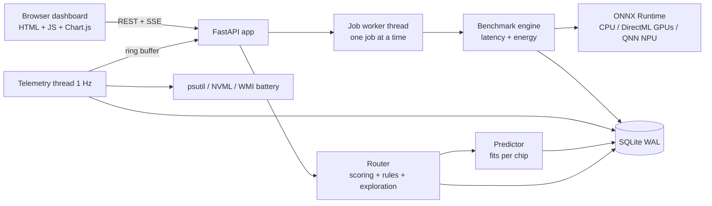

# SiliconRoute — Technical Specification (v1)

Read `AGENTS.md` first. This file is the detailed contract. When code and spec
disagree, ask; do not silently change the spec.

---

## 0. One-paragraph summary

SiliconRoute runs AI models on every chip in the laptop, records timings,
power and temperature in SQLite, fits a simple *hardware model* per chip
(fixed overhead + compute time + memory time), and uses those models plus
live conditions (battery, charger, GPU temperature, GPU busy) to pick the best
chip for each AI task under a user goal. It then verifies the choice by
measuring, reports whether it was right, and learns from the result.

---

## 1. Architecture

Threads inside ONE Python process (uvicorn, 1 worker):
- **Event loop**: FastAPI routes (fast; never run models here).
- **Job worker**: consumes `queue.Queue`; runs benchmark/energy/route-verify
  jobs strictly one at a time; publishes progress to an in-memory dict.
- **Telemetry sampler**: samples every 1.0 s into `collections.deque(maxlen=3600)`,
  flushes to DB every 10 s in one short transaction, pushes each sample to SSE
  subscribers via `loop.call_soon_threadsafe(queue.put_nowait, sample)`.

Start both threads in FastAPI `lifespan`; stop them cleanly on shutdown
(threading.Event). Never block the event loop with ORT or WMI calls.

---

## 2. Measurement methodology (the heart of the project)

### 2.1 Latency run (per model × device × batch)
1. Create the ORT session. Record `session_create_ms` (cold-start cost).
2. Verify `provider_used = sess.get_providers()[0]`. If it is not the
   requested provider, store the run with `provider_mismatch = true` and exclude it
   from fits.
3. Input: `np.random.default_rng(SEED)` fixed per (model, batch), float32.
4. Warm-up: `WARMUP_RUNS` (default 5) untimed runs.
5. Adaptive inner loop: run a trial inference. If trial < 1.0 ms, time an
   inner loop of `k` runs per sample (choose `k` so each sample is >= 1.0 ms,
   cap `k` at 1000) and store per-inference time = `sample / k`. Record `inner_loop_k`.
6. Timed: `TIMED_RUNS` (default 30) samples with `time.perf_counter_ns()`.
7. Stats: median, p10, p90, mean, min, max, stdev, `cv = stdev/mean`.
   Robust stability metric: `spread = (p90 - p10) / median`.
   Flag `unstable = spread > 0.30` (keep in DB, flag in UI; exclude from fits if
   `EXCLUDE_UNSTABLE=True`). Keep `cv` stored for reference.
8. Correctness: compare output with the CPU reference output for the same
   input: `rel_err = max|out-ref| / (max|ref| + 1e-9)`. Store
   `output_matches_cpu = rel_err <= 1e-2`, `max_rel_err`, and `output_hash`. A chip that gives
   wrong answers must never be chosen by the router.
9. Store the 30 raw timings as JSON in `raw_ms` (for histograms).

Hygiene (store with the session, show in UI):
- `plugged_in`, `battery_pct` at start and end, `ram_pct` at start
  (warn if > 85%), Windows power scheme from `powercfg /getactivescheme`
  (store the text), free-text `notes` (user writes e.g. "Armoury: Performance").
- Shuffle device order per model (avoid thermal bias). Sleep
  `COOLDOWN_S` (default 2 s) when switching device. Record GPU temp at start/end
  of each run when NVML exists.
- CPU threads: set `intra_op_num_threads = psutil.cpu_count(logical=False)`
  and record it.

### 2.2 Energy run (separate job type)
Laptop sensors update slowly, so energy needs longer windows.
- **Battery method** (whole laptop, only when UNPLUGGED): `DischargeRate`
  (mW) from WMI `root\wmi` `BatteryStatus` (reads 0 when plugged in).
  1. Idle baseline: sample for `IDLE_WINDOW_S` (15 s) with nothing running →
     `idle_w` = median.
  2. Load: run the model in a loop for `LOAD_WINDOW_S` (30 s); ignore the
     first `SETTLE_S` (5 s) of samples; `load_w` = median of the rest;
     `n` = inferences completed in the counted window; `t` = window seconds.
  3. `energy_mj_per_inf = max(load_w - idle_w, 0) * t * 1000 / n`
     → label `energy_method = "battery_delta"` ("extra whole-laptop energy").
- **NVML method** (NVIDIA GPU only, works plugged in): use
  `nvmlDeviceGetTotalEnergyConsumption` (mJ counter) before/after the load
  window → `energy_method = "nvml_counter"`; if not supported, average
  `nvmlDeviceGetPowerUsage` (mW) samples → `"nvml_power"`. This is GPU-board
  energy only — say so in the UI.
- If no method is available → leave energy NULL and show
  "Unplug the charger to measure whole-laptop energy".

### 2.3 Device identification & duplicate detection
DirectML `device_id` numbers are adapter indexes, not names. Provide
`POST /api/devices/{id}/identify`: runs a heavy model on that device for 8 s
so the user can see which GPU graph jumps in Task Manager, then set a label
with `PATCH /api/devices/{id}`. Allowed device kinds: `cpu|igpu|dgpu|npu|software|unknown`.
Never guess the GPU name.

Duplicate check: If two DirectML devices give bit-identical outputs on the same
input AND their medians differ by < 5% on at least 3 runs, mark the later device
`is_available = false` with `unavailable_reason = "suspected duplicate of dml:X"`.
Do not delete rows. Never guess names.

---

## 3. Synthetic model families (`models_gen.py`)

All built with `onnx.helper`, opset 17, `ir_version = 8`, dynamic batch dim
`"batch"`, float32 weights from a fixed seed. Each generator returns exact
`params`, `flops_per_sample` and `weight_bytes`.

| family | graph | size knobs | FLOPs per sample |
|---|---|---|---|
| mlp  | L × (MatMul W[n×n] → Relu) | width n, layers L | 2·L·n² |
| conv | L × (Conv 3×3, C→C, pad 1 → Relu) on C×H×W | channels C, H=W, layers L | 2·L·H·W·C²·9 |
| attn | L × (Q,K,V MatMul → Softmax(QKᵀ/√d) → ·V → out MatMul) on T×d | d, tokens T, layers L | L·(8·T·d² + 4·T²·d) |

Default size ladders (many points = better fits; max weights ≈ 300 MB):
- mlp: widths [128, 256, 384, 512, 768, 1024, 1536, 2048, 3072, 4096], L=4
- conv: C in [8, 16, 32, 48, 64, 96, 128], H=W=64, L=4
- attn: d in [64, 128, 256, 384, 512, 768, 1024], T=128, L=2
- batches: [1, 8, 32] (needed to separate compute time from memory time)

Real `.onnx` files placed in `models/` can be registered by
`POST /api/models/scan`; for them compute `weight_bytes` from initializers and
`flops_per_sample` only for MatMul/Gemm/Conv after
`onnx.shape_inference.infer_shapes` (else NULL; predictor then uses bytes only).

---

## 4. Data model (SQLModel, `db.py`)

Engine: `create_engine("sqlite:///data/siliconroute.db",
connect_args={"check_same_thread": False})` plus an
`@event.listens_for(engine, "connect")` hook executing:
`PRAGMA journal_mode=WAL; PRAGMA synchronous=NORMAL; PRAGMA busy_timeout=5000; PRAGMA foreign_keys=ON;`
Test must assert `PRAGMA journal_mode` returns `wal`.

JSON columns are stored as TEXT (json.dumps). Times are UTC ISO strings.

**Device**: id PK · key str unique (`cpu`, `dml:0`, `dml:1`, `qnn:0`) ·
label str · kind (`cpu|igpu|dgpu|npu|unknown`) · provider str ·
provider_options_json str · is_available bool · detected_at.

**AIModel**: id PK · name unique · family (`mlp|conv|attn|file`) · source
(`synthetic|file`) · path · sha256 · params int · flops_per_sample float NULL ·
weight_bytes int · size_mb float · precision (`fp32|fp16|int8`) ·
input_shape_json · created_at.

**BenchSession**: id PK · kind (`latency|energy|verify`) · status
(`queued|running|done|failed|cancelled`) · config_json · created_at ·
started_at · finished_at · plugged_in · battery_start · battery_end ·
ram_pct_start · power_scheme · notes · error NULL.

**Run**: id PK · session_id FK · ai_model_id FK · device_id FK ·
provider_used · provider_mismatch bool · batch int · intra_op_threads int ·
warmup_runs · timed_runs · session_create_ms · median_ms · p10_ms · p90_ms ·
mean_ms · min_ms · max_ms · stdev_ms · cv · unstable bool ·
throughput_per_s · raw_ms_json · output_matches_cpu bool NULL ·
max_rel_err float NULL · gpu_temp_start_c NULL · gpu_temp_end_c NULL ·
plugged_in · battery_pct NULL · energy_mj_per_inf NULL · energy_method NULL ·
idle_w NULL · load_w NULL · created_at.
Index: (ai_model_id, device_id, batch).

**TelemetrySample**: id PK · ts (indexed) · session_id NULL · cpu_pct ·
cpu_freq_mhz NULL · ram_pct · battery_pct NULL · plugged_in NULL ·
discharge_w NULL · gpu_util_pct NULL · gpu_power_w NULL · gpu_temp_c NULL ·
gpu_mem_used_mb NULL.

**Fit**: id PK · device_id FK · target (`latency|energy`) · model_form
(`roofline|roofline_cache|loglinear`) · loo_mape_all_json (all 3 forms) · coef_json · n_samples · r2_log · loo_mape_pct ·
trained_at · is_active bool (only the newest per device+target is active).

**Decision**: id PK · ts · ai_model_id FK · batch · mode · power_budget_w NULL ·
context_json (battery, plugged, temps, busy) · candidates_json (per device:
predicted_ms, predicted_mj, score, excluded_reason) · chosen_device_id ·
explored bool · reason · actual_ms NULL · best_device_id_actual NULL ·
was_best NULL · regret_pct NULL.

---

## 5. Predictor (`predictor.py`) — the hardware model

### 5.1 Features (per run, batch B)
- `work_gflop = flops_per_sample * B / 1e9`
- `data_gb = weight_bytes / 1e9` (weights are read once per inference)
- `cache_mb` per device (config, editable in UI): CPU default 64 (Ryzen 9
  8940HX L3 = 64 MB from Task Manager); GPUs default 0 (= no split).

### 5.2 Three candidate forms — pick the best per device automatically
- **F1 roofline**: `t_ms = t0 + a*work_gflop + b*data_gb` (t0, a, b ≥ 0)
- **F2 roofline + cache**: `t_ms = t0 + a*work_gflop + b1*min(data_gb, cache_gb)
  + b2*max(data_gb - cache_gb, 0)` (all ≥ 0). Models the real effect that
  weights which no longer fit in cache are read from slower DRAM.
- **F3 log-linear**: `log10(t) = c0 + c1*log10(params) + c2*log10(B)` (OLS).

F1/F2: `scipy.optimize.nnls` on the weighted system (multiply each row and
target by `1/t_ms` → minimises relative error). F3: `numpy.linalg.lstsq`.

Selection: compute leave-one-out MAPE for each form; keep the lowest; store
`model_form`. Show all three LOO scores in the UI (honest model selection).

Physical meaning (only when F1/F2 wins) shown in the UI:
- `t0` = fixed overhead (kernel launch + data transfer), ms
- compute throughput = `1000 / a` GFLOP/s
- memory bandwidth = `1000 / b` GB/s (F2: cache and DRAM separately)
Note: compute and memory terms can only be separated when the data has
several batch sizes or several families; otherwise say "not separable".

Reference result (dev sandbox, CPU, 10 points, noisy shared server): all
forms gave 24-32% LOO MAPE. Expect better with the full ladders on a quiet
laptop. What matters most is RANKING near the crossover — that is handled by
exploration + verification (section 6), and judged by decision accuracy.

### 5.3 Validation
- Require `n_samples >= MIN_FIT_SAMPLES` (6) per device, else no fit
  (HTTP 409 with a clear message).
- LOO MAPE per form; `r2_log` on log10 values for the chosen form.
- Energy fits: same procedure on `energy_mj_per_inf` (rows with energy only).

### 5.4 Crossover (explainability)
For two devices X, Y, a family and a fixed B, evaluate both predictions on a
fine grid of sizes and report where the faster device changes
(`GET /api/analysis/crossover?family=mlp&batch=1`), or
"X always faster in the measured range". Never extrapolate beyond 2x the
largest measured size; label anything outside the range as extrapolated.

### 5.5 Refit policy
Auto-refit a device after every `REFIT_EVERY` (10) new runs for it, and on
`POST /api/fit`.

---

## 6. Router (`router.py`) — the decision engine

Input: `ai_model_id, batch, mode ∈ {fastest, battery, balanced, cool}`,
optional `power_budget_w`.

1. **Candidates**: devices that are available, have an active latency fit, and
   are not known to give wrong outputs for this model (`output_matches_cpu` is
   not false). Each excluded device gets an `excluded_reason`.
2. **Predict** `t_d` (ms) and `E_d` (mJ, if energy fit exists).
3. **Normalise**: `t̂_d = t_d / min(t)`, `Ê_d = E_d / min(E)`.
4. **Score** (lower is better):
   - fastest: `t̂`
   - battery: `Ê`; if no energy data for ≥ 2 devices → use `t̂` and set
     reason "energy not measured yet; ranked by speed".
   - balanced: `0.5·t̂ + 0.5·Ê` (or `t̂` with the same note).
   - cool: `t̂ + 0.5·max(0, gpu_temp − 75)/10` for the GPU with NVML temp;
     `+∞` if temp > 87 °C. CPU temperature is not readable on Windows via
     psutil → no penalty, and say so.
5. **Context rules** (log each one that fires in `context_json`):
   - Unplugged and battery < `LOW_BATTERY_PCT` (30) → switch mode to battery.
   - NVIDIA util > 80% from other apps → multiply that GPU's score by 1.3.
   - `power_budget_w` set → exclude devices whose measured `load_w`
     exceeds the budget (only if measured; else note "no power data").
6. **Exploration** (keeps learning): if a device has < 6 samples, or with
   probability `EPSILON` (0.10) when the runner-up is within 20% of the best,
   choose the runner-up and set `explored = true` (say so in the reason).
7. **Reason** (plain English, real predicted numbers only), e.g.
   "Chose GPU1 for mlp-2048 (batch 32), Fastest: predicted 3.1 ms vs CPU 9.8 ms.
   Plugged in, battery 82%."
8. **Verify** (`/api/route` with `verify=true`, runs in the job worker): measure
   the chosen device (10 timed runs, median) and every other candidate; set
   `actual_ms`, `best_device_id_actual`, `was_best`,
   `regret_pct = (t_chosen − t_best)/t_best·100`. Store those runs too
   (they improve the fits).

### 6.1 Baselines (for the evaluation slide)
`GET /api/decisions/stats` returns, over verified decisions: accuracy
(`was_best` rate), mean and p90 regret, and the same metrics for static
baselines computed from the same verify runs: "always CPU", "always fastest
GPU", and — stretch goal — ONNX Runtime's own policy
(`SessionOptions.set_provider_selection_policy`, e.g. MAX_PERFORMANCE) when the
installed ORT supports it (feature-detect with `hasattr`; if unsupported or it
errors, report "not available on this ORT build").

---

## 7. Telemetry & power (`telemetry.py`, `power.py`)

Every reader returns `None` when unavailable — never raises into the sampler.
- psutil: `cpu_percent(interval=None)`, `cpu_freq().current`,
  `virtual_memory().percent`, `sensors_battery()` (percent, power_plugged).
- NVML (`import pynvml` from package `nvidia-ml-py`): `nvmlInit()` once;
  `nvmlDeviceGetUtilizationRates`, `nvmlDeviceGetPowerUsage` (mW → W),
  `nvmlDeviceGetTemperature(h, NVML_TEMPERATURE_GPU)`,
  `nvmlDeviceGetMemoryInfo`. Catch `pynvml.NVMLError`.
- WMI battery: in the sampler thread call `pythoncom.CoInitialize()` first,
  then `wmi.WMI(namespace="root\\wmi")` and query
  `SELECT DischargeRate, PowerOnline FROM BatteryStatus WHERE Voltage > 0`;
  `DischargeRate` is mW (0 when plugged in).
- The AMD Radeon iGPU and CPU package power are NOT available → show
  "not available" (do not approximate).

SSE: `GET /api/telemetry/stream` with `response_class=EventSourceResponse`,
yielding one JSON sample per second from an `asyncio.Queue` per client;
remove the queue on disconnect.

---

## 8. API contract

All JSON. Errors: `{"detail": "..."}` with 400/404/409/422/500.

| Method | Path | Body / query | Returns |
|---|---|---|---|
| GET | /api/health | – | `{"status":"ok","version":"1.0.0"}` |
| GET | /api/system | – | cpu name, physical/logical cores, ram_gb, os, ort_version, providers, nvml, battery, plugged_in |
| POST | /api/devices/detect | – | list of Device |
| GET | /api/devices | – | list of Device |
| PATCH | /api/devices/{id} | `{"label":"NVIDIA RTX ..."}` | Device |
| POST | /api/devices/{id}/identify | – | `{"session_id":..}` (8 s load job) |
| GET | /api/models | `?family=` | list of AIModel |
| POST | /api/models/synthetic | `{"family":"mlp","sizes":[256,512],"layers":4}` | created models |
| POST | /api/models/scan | – | newly registered .onnx files |
| POST | /api/benchmarks | `{"kind":"latency","model_ids":[..],"device_ids":[..],"batches":[1,32],"warmup":5,"runs":30,"notes":""}` | `{"session_id":..,"status":"queued"}`; 409 if busy |
| GET | /api/benchmarks/{id} | – | status, progress `{done,total}`, current item, error |
| POST | /api/benchmarks/{id}/cancel | – | status |
| GET | /api/runs | `?model_id&device_id&batch&limit=500` | list of Run |
| GET | /api/telemetry/latest | – | last sample |
| GET | /api/telemetry | `?seconds=120` | samples from ring buffer |
| GET | /api/telemetry/stream | – | SSE, 1 sample/s |
| POST | /api/fit | `{"target":"latency"}` | list of Fit (with physical params) |
| GET | /api/fit | – | active fits |
| GET | /api/analysis/crossover | `?family&batch` | crossover table |
| POST | /api/recommend | `{"ai_model_id":..,"batch":1,"mode":"fastest","power_budget_w":null}` | chosen, candidates, reason, context |
| POST | /api/route | same + `"verify":true` | decision id; verify runs as a job |
| GET | /api/decisions | `?limit=100` | list of Decision |
| GET | /api/decisions/stats | – | accuracy, regret, baselines |
| GET | /api/export/runs.csv | – | CSV download |
| GET | /api/export/decisions.csv | – | CSV download |

Mount `frontend/` with `StaticFiles(directory="frontend", html=True)` at `/`
AFTER the API routers.

---

## 9. Frontend (`frontend/`)

Plain HTML + JS modules + Chart.js 4 from cdnjs (pinned version). Dark theme
matching the pitch deck: background `#0E1116`, cards `#1A1F29`, accent copper
`#D98A3D`, efficient mint `#3CCFA0`, text `#EDEFF3`, muted `#9AA3B2`.
Numbers in a monospace font, units always shown, "not available" as a grey pill.

Tabs:
1. **Live** — last 120 s line charts: CPU %, RAM %, GPU util/power/temp,
   battery discharge W; status chips (plugged, battery %, power scheme).
2. **Benchmark** — pick families/sizes, devices, batches, notes; Start;
   progress bar (poll `/api/benchmarks/{id}` every 1 s); results table with
   unstable/mismatch badges; "Identify" button per GPU + label editor.
3. **Analysis** — (a) log-log scatter median_ms vs work (GFLOP) per device,
   batch selector, fitted curves; (b) physical params table per device
   (overhead ms, GFLOP/s, GB/s, LOO MAPE); (c) predicted-vs-actual scatter with
   y = x line; (d) energy-vs-time scatter with Pareto front highlighted;
   (e) crossover table.
4. **Router** — choose model, batch, mode, optional power budget →
   decision card (chosen chip, reason, candidates table with scores and
   excluded reasons). Button "Run & verify" → shows actual vs predicted and
   whether it was the best.
5. **History** — decisions table; accuracy and regret vs baselines;
   regret histogram.
6. **About** — method explanation, honesty rule, hardware info.

---

## 10. Configuration (`config.py`)

`SEED=1234, WARMUP_RUNS=5, TIMED_RUNS=30, VERIFY_RUNS=10, COOLDOWN_S=2,
UNSTABLE_CV=0.15, EXCLUDE_UNSTABLE=True, IDLE_WINDOW_S=15, LOAD_WINDOW_S=30,
SETTLE_S=5, IDENTIFY_S=8, MIN_FIT_SAMPLES=6, REFIT_EVERY=10, EPSILON=0.10,
EXPLORE_MARGIN=0.20, LOW_BATTERY_PCT=30, HOT_GPU_C=75, MAX_GPU_C=87,
TELEMETRY_HZ=1, TELEMETRY_FLUSH_S=10, MAX_WEIGHT_MB=300,
BATCHES=[1, 8, 32], CPU_CACHE_MB=64, GPU_CACHE_MB=0`

---

## 11. Tests (`tests/`)

- `test_db.py`: tables created; `PRAGMA journal_mode` == `wal`.
- `test_models_gen.py`: params/FLOPs formulas match counted initializers;
  models load in ORT CPU; dynamic batch works for B=1 and B=4.
- `test_benchmark.py`: tiny mlp on CPU: provider_used == CPUExecutionProvider,
  min ≤ p10 ≤ median ≤ p90 ≤ max, raw_ms length == runs, output_matches_cpu.
- `test_predictor.py`: generate synthetic times from known t0, a, b (tests only!)
  → nnls recovers them within 5%; form selection picks F1 on F1-shaped data and
  F3 on power-law data; LOO MAPE computed; < 6 samples → error.
- `test_router.py`: fake fits → fastest picks min time; battery falls back with
  note when no energy; low-battery rule fires; excluded device reasons;
  exploration deterministic with a seeded RNG.
- `test_api.py`: TestClient — health, detect, create synthetic models, start a
  tiny benchmark (warmup=1, runs=3), poll until done, runs returned,
  second start while running → 409, CSV export has header.
- `test_honesty.py`: scan `app/` and `frontend/` for suspicious hardcoded
  metrics (regex like `\b\d+(\.\d+)?\s*(ms|W|mJ|GFLOP)` inside string
  literals outside `config.py`) → fail with file:line.

---

## 12. Build phases & acceptance criteria

| # | Phase | Done when |
|---|---|---|
| 1 | Foundation: config, db, devices, system, health, static page | pytest green; `/api/devices` lists CPU + each DML GPU on the laptop |
| 2 | Models + benchmark engine + job worker | real latency runs stored for mlp family on all devices; 409 on double start |
| 3 | Telemetry + power + energy jobs + identify | SSE streams real samples; energy runs work unplugged (battery) and/or NVML |
| 4 | Predictor + crossover | fits per device with physical params + LOO MAPE on real data |
| 5 | Router + verify + stats + baselines | 10+ verified decisions with accuracy and regret shown |
| 6 | Dashboard (all tabs) | browser agent clicks every tab; screenshots; no console errors |
| 7 | Hardening: start.bat, README, errors, tests, honesty test | fresh clone → start.bat works; all tests pass |
| 8 | Real data collection + export for the pitch deck | CSV exported; README results table filled from DB |

---

## 13. Known pitfalls (read before debugging)

- DirectML needs `enable_mem_pattern=False` and
  `execution_mode=ORT_SEQUENTIAL` in SessionOptions.
- Install ONLY `onnxruntime-directml` (not also `onnxruntime`) — they conflict.
- NVIDIA GPU hidden in Task Manager = laptop in Eco/iGPU-only mode
  (ASUS Armoury Crate → GPU mode Standard/Ultimate).
- `database is locked` → pragmas missing or a long transaction; keep writes short.
- WMI in a thread without `pythoncom.CoInitialize()` fails.
- Battery DischargeRate is 0 while charging → energy "not available" when plugged.
- First runs are slow (JIT, caches, clocks) → that is why warm-up exists.
- RAM near full (the dev laptop often is) → close browser tabs before benchmarks.
- Chart.js must be loaded before `app.js`; use `defer` on both, in order.
